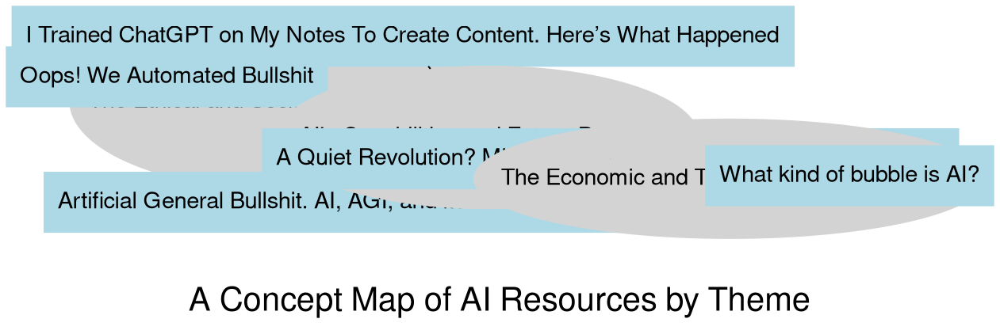
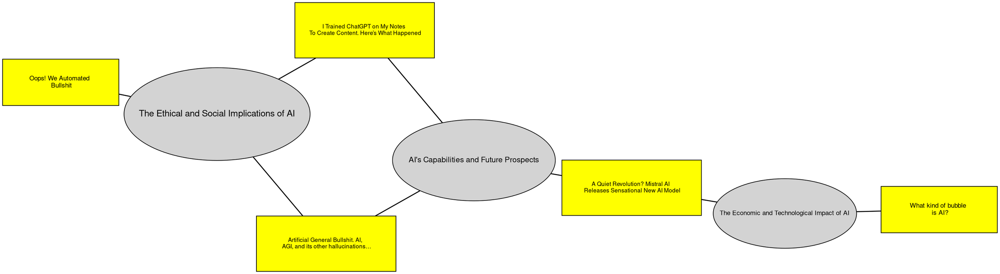
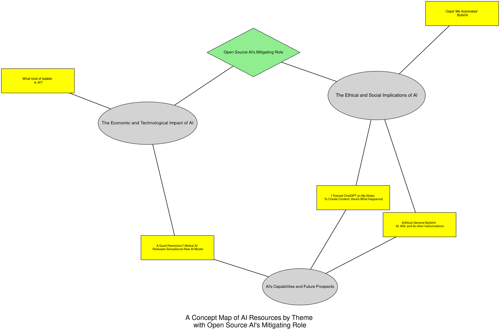
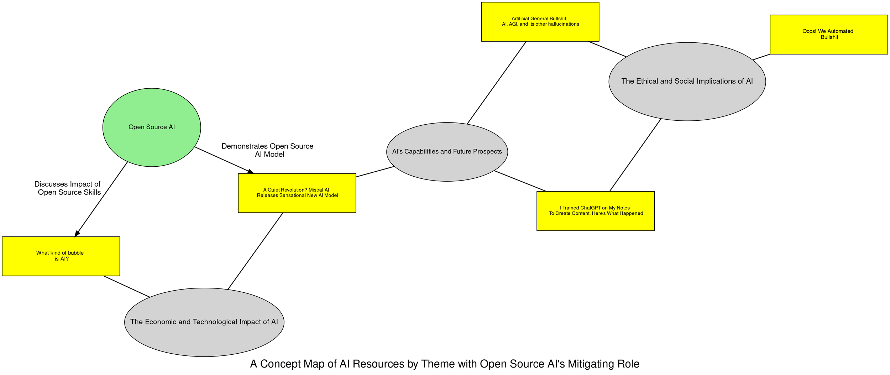

Part of [[experiment 10]]
## You:
You are a skilled summariser of online content for newsletters. I will give you a set of articles. For each article I will give you its title, URL and a summary. You will write a 500 word editorial summarising the main themes covered by the articles, in particular highlighting themes common to several articles. Follow the editorial with the articles listed in the following format:  
## article title  
An 80 word summary of the article.  
  
Provide all content in markdown format, with each article title linked to the URL provided with it.  
Here are the articles you are to summarise:

2. Oops! We Automated Bullshit
   URL: [https://www.cst.cam.ac.uk/blog/afb21/oops-we-automated-bullshit](https://www.cst.cam.ac.uk/blog/afb21/oops-we-automated-bullshit)
   According to:

   - MIT Professor of AI Rodney Brooks, ChatGPT "“just makes up stuff that sounds good"... where “sounds good” is an algorithm to imitate text found on the internet, while “makes up” is the basic randomness of relying on predictive text rather than logic or facts",
   - Geoff Hinton: "the greatest risks is not that chatbots will become super-intelligent, but that they will generate text that is super-persuasive without being intelligent, in the manner of Donald Trump or Boris Johnson",
   - Harry Frankfurt "explains that the bullshitter “does not reject the authority of truth, as the liar does […] He pays no attention to it ... bullshit is a greater enemy of the truth than lies are”",
   - Graeber’s famous analysis of Bullshit Jobs ... revealed that over 30% of British workers believe their own job contributes nothing of any value to society... writing pointless reports, relaying messages from one person to another, or listening to complaints they can do nothing about... [all] easily done by ChatGPT... we train people for bullshit jobs by training them to generate bullshit.

3. What kind of bubble is AI?
   URL: [https://doctorow.medium.com/what-kind-of-bubble-is-ai-d02040b5573a](https://doctorow.medium.com/what-kind-of-bubble-is-ai-d02040b5573a)
   "All economic bubbles are hugely destructive, but some ... leave behind (useful) wreckage that can be salvaged":

   - the first dotcom bubble left behind "cheap servers, office furniture and space... a generation of young people ,,, trained as web makers... technologists from non-technical backgrounds"
   - crypto bubble: "a smattering of Rust programmers... bad digital art and worse Austrian economics"

   Which type is the AI bubble? We'll have "a legion of technologists who are learning Tensorflow and Pytorch", but while "nominally open source" they're bound to Google and Facebook - "if those environments go away, those programming skills become a lot less useful."

4. A Quiet Revolution? Mistral AI Releases Sensational New AI Model
   URL: [https://medium.com/tales-of-tomorrow/a-quiet-revolution-mistral-ai-releases-sensational-new-ai-model-c17c663287f0](https://medium.com/tales-of-tomorrow/a-quiet-revolution-mistral-ai-releases-sensational-new-ai-model-c17c663287f0)
   "startup Mistral AI posted a download link to their latest language model". In many ways it's equivalent to GPT4: context size of 32k tokens, and built using the “Mixture Of Experts” model, combining "several highly specialized language models... 8 experts with 7 billion parameters each: “8x7B”... a training method for AI systems in which, instead of a single model learning everything, a combination of sub-models is used", with a gating network " assigning tasks to the experts" and combining their insights.

5. Artificial General Bullshit. AI, AGI, and its other hallucinations…
   URL: [https://medium.com/whither-news/artificial-general-bullshit-e480939332f6](https://medium.com/whither-news/artificial-general-bullshit-e480939332f6)
   At an AI conference, Jeff Jarvis "knew I was in the right place when I heard AGI brought up and quickly dismissed... I call bullshit... large language models might prove to be a parlor trick". The rest of the conference focused on "frameworks for discussion of responsible use of AI".

6. I Trained ChatGPT on My Notes To Create Content. Here’s What Happened
   URL: [https://medium.com/the-generator/i-trained-chatgpt-on-my-notes-heres-what-happened-1dcb48725f45](https://medium.com/the-generator/i-trained-chatgpt-on-my-notes-heres-what-happened-1dcb48725f45)
   Like me, the author has "been taking notes for over a decade ...ended up with thousands of notes that I never revisited. So I decided to train ChatGPT on my 3,743 Obsidian notes", which were created for "one purpose: content creation. So I use an improved version of the Zettelkasten".

## ChatGPT:
[[C-10-fullnotes-gpt4-extract-newsletter]]

## You:
Please now act as a superb organiser and classifier of ideas and content. First identify and briefly summarise the top themes running through some or all of the above resources. For each theme list the relevant resources. Please list the most important themes - those relevant to the most resources - first. Please ensure each theme's title is short, and only provide at most 6 themes to start with. Then ask me if I want you to remove some themes, or generate more, or rename some.

## ChatGPT:
### Theme 1: AI's Ethical and Societal Impact

**Summary:** The concern over AI's potential to automate tasks that lack societal value and its ability to produce content without regard to truth raises significant ethical and societal questions. This theme encompasses the risks of AI systems being used to perpetuate "bullshit jobs," the ethical considerations in AI development, and the broader societal impacts of deploying AI technologies without adequate safeguards for truth and value.

- [Oops! We Automated Bullshit](https://www.cst.cam.ac.uk/blog/afb21/oops-we-automated-bullshit)
- [Artificial General Bullshit. AI, AGI, and its other hallucinations…](https://medium.com/whither-news/artificial-general-bullshit-e480939332f6)

### Theme 2: The AI Bubble and Its Aftermath

**Summary:** The discussion around the AI bubble focuses on the economic and technological repercussions of an AI-driven economic bubble, comparing it to previous bubbles like the dotcom and crypto bubbles. It speculates on what remains after the bubble bursts, such as the skills and infrastructure that could benefit future technological developments or become obsolete.

- [What kind of bubble is AI?](https://doctorow.medium.com/what-kind-of-bubble-is-ai-d02040b5573a)

### Theme 3: AI's Capabilities and Limitations

**Summary:** These articles explore the current capabilities and inherent limitations of AI, specifically large language models. They delve into AI's ability to generate persuasive content without true intelligence, its role in content creation, and the challenges in developing models that genuinely understand context and content.

- [Oops! We Automated Bullshit](https://www.cst.cam.ac.uk/blog/afb21/oops-we-automated-bullshit)
- [A Quiet Revolution? Mistral AI Releases Sensational New AI Model](https://medium.com/tales-of-tomorrow/a-quiet-revolution-mistral-ai-releases-sensational-new-ai-model-c17c663287f0)
- [I Trained ChatGPT on My Notes To Create Content. Here’s What Happened](https://medium.com/the-generator/i-trained-chatgpt-on-my-notes-heres-what-happened-1dcb48725f45)

### Theme 4: Innovation in AI Technology

**Summary:** Highlighting the advancements in AI technology, this theme covers the development of new AI models that promise improved performance and capabilities. It includes the exploration of novel architectures like the "Mixture Of Experts" model, which indicates a move towards more specialized and efficient AI systems.

- [A Quiet Revolution? Mistral AI Releases Sensational New AI Model](https://medium.com/tales-of-tomorrow/a-quiet-revolution-mistral-ai-releases-sensational-new-ai-model-c17c663287f0)

### Theme 5: Skepticism Towards AGI

**Summary:** Reflecting on the skepticism within the AI community towards the concept of Artificial General Intelligence, this theme includes insights from conferences and expert opinions that challenge the feasibility and current understanding of AGI, emphasizing the importance of focusing on responsible AI use.

- [Artificial General Bullshit. AI, AGI, and its other hallucinations…](https://medium.com/whither-news/artificial-general-bullshit-e480939332f6)

### Theme 6: Personal Experiences with AI

**Summary:** Personal accounts of interacting with AI for content creation provide practical insights into AI's real-world applications and limitations. These narratives offer a unique perspective on how AI can be used to leverage personal knowledge bases for content generation, highlighting both its potential and its shortcomings.

- [I Trained ChatGPT on My Notes To Create Content. Here’s What Happened](https://medium.com/the-generator/i-trained-chatgpt-on-my-notes-heres-what-happened-1dcb48725f45)

Would you like me to refine any of these themes, generate more, or rename some?

## You:
A good theme encompasses ideas from at least 2 and preferably more articles. However, you provide 6 themes for only 5 articles, with 4 of your themes referencing only one article each. Please redo, ensuring that there are fewer, broader themes, each referencing at least 2 and as many as 4 different articles. Each article can appear in more than one theme, but not all of them.

## ChatGPT:
### Theme 1: The Ethical and Social Implications of AI

**Summary:** A prominent concern across multiple articles is the ethical and social implications of AI, particularly its ability to generate content without true understanding or adherence to ethical standards. This theme captures the critique of AI's role in perpetuating misinformation and the broader societal consequences of deploying AI without considering its impact on truth, ethics, and the value of human work.

- [Oops! We Automated Bullshit](https://www.cst.cam.ac.uk/blog/afb21/oops-we-automated-bullshit)
- [Artificial General Bullshit. AI, AGI, and its other hallucinations…](https://medium.com/whither-news/artificial-general-bullshit-e480939332f6)
- [I Trained ChatGPT on My Notes To Create Content. Here’s What Happened](https://medium.com/the-generator/i-trained-chatgpt-on-my-notes-heres-what-happened-1dcb48725f45)

### Theme 2: AI's Capabilities and Future Prospects

**Summary:** These articles explore AI's current capabilities, limitations, and future prospects, touching upon the technological advancements in AI models and the skepticism surrounding the hype of AGI. This theme also considers the practical applications of AI in content creation, reflecting on both the optimism for AI's potential and the critical perspective on its limitations.

- [A Quiet Revolution? Mistral AI Releases Sensational New AI Model](https://medium.com/tales-of-tomorrow/a-quiet-revolution-mistral-ai-releases-sensational-new-ai-model-c17c663287f0)
- [Artificial General Bullshit. AI, AGI, and its other hallucinations…](https://medium.com/whither-news/artificial-general-bullshit-e480939332f6)
- [I Trained ChatGPT on My Notes To Create Content. Here’s What Happened](https://medium.com/the-generator/i-trained-chatgpt-on-my-notes-heres-what-happened-1dcb48725f45)

### Theme 3: The Economic and Technological Impact of AI

**Summary:** This theme delves into the economic and technological impacts of AI, discussing the potential of an AI bubble and what might remain post-bubble. It reflects on the lessons learned from previous bubbles and the skills and infrastructure that could either propel technology forward or become obsolete, emphasizing the need for sustainable development in AI.

- [What kind of bubble is AI?](https://doctorow.medium.com/what-kind-of-bubble-is-ai-d02040b5573a)
- [A Quiet Revolution? Mistral AI Releases Sensational New AI Model](https://medium.com/tales-of-tomorrow/a-quiet-revolution-mistral-ai-releases-sensational-new-ai-model-c17c663287f0)

Would you like to adjust these themes further, or explore any specific theme in more detail?

## You:
Now you are going to generate the Graphviz code for a Entity-Relation Data Model concept map of these resources and themes, where each resources is connected to the relevant themes. The map's nodes representing the resources should all be squares and have the same size. The nodes representing the themes should be ellipses, and sized according to their importance: the most important theme should have the largest node.  
  
I will show you an example of some code for a concept map visualising 4 resources and three themes:  
graph ER {  
fontname="Helvetica,Arial,sans-serif"  
node [fontname="Helvetica,Arial,sans-serif"]  
edge [fontname="Helvetica,Arial,sans-serif"]  
layout=neato  
node [shape=box]; theme1; "theme 2"; theme3;  
node [shape=ellipse]; resource1; "resource 2"; "resource 3"; "resource 4";  
  
theme1 -- resource1;  
theme1 -- "resource 2";  
theme1 -- "resource 3";  
theme3 -- "resource 2";  
"theme 2" -- "resource 2";  
theme3 -- resource1;  
theme3 -- "resource 4";  
"theme 2" -- "resource 4";  
label = "\n\A concept map\of your resources by theme";  
fontsize=20;  
}  
  
Now provide the same sort of code for the resources and themes, using the resource titles and the themes.

## ChatGPT:

This Graphviz code describes a concept map that visualizes the connection between the themes and resources identified in the discussion. Each theme is connected to the relevant articles, providing a clear overview of how each resource contributes to the broader themes.

![[C-10-fullnotes-responseGPT4--conceptmap1.jpeg]]

## You:
Please update the visualisation as follows. The nodes representing the themes should be grey-filled ellipses, with their size adjusted according to their importance: the most important theme should have the largest node, and a correspondingly larger font size. The map's nodes representing the resources should all be yellow-filled rectangles. All Resource titles should fit snugly within their nodes' boundaries. Their texts should ideally all have the same font size, unless the title is very long. As the Resources' titles are often long, include labels for each Resource. Each Resource's label should be the same as the Resource's title, except that you should insert a linebreak ("\n") just before any hyphens, or just after any commas or full stops, and remove any reference to the publisher. If there are no such punctuation marks, insert a linebreak ("\n") after every 4 or 5 words. Remove any line breaks at the end of the Resource labels.  
  
Reduce node separation to make the concept map compact, but avoid overlaps.  
  
I will show you an example of some code for a concept map visualising 4 resources and three themes:  
graph ER {  
fontname="Helvetica,Arial,sans-serif"  
node [fontname="Helvetica,Arial,sans-serif"]  
edge [fontname="Helvetica,Arial,sans-serif"]  
layout=neato  
edge [penwidth=1.5];  
overlap=false;  
nodesep=0.1; // Reduced node separation  
ranksep=0.5; // Reduced rank separation  
// Themes with labels and fontsize  
"Theme 1 title" [width=3, height=2, style=filled, fillcolor=lightgrey];  
"Theme 2 title" [width=1.5, height=1, style=filled, fillcolor=lightgrey];  
"Theme 3 title" [width=2, height=1, style=filled, fillcolor=lightgrey];  
// Resources with labels and adjusted width and height  
"Resource 1 Title needs a linebreak" [shape=box, style=filled, fillcolor=yellow, label="Resource Title 1 \n needs a linebreak", width=2, height=0.8, fontsize=10];  
"Resource 2 Title is very long and so has two linebreaks, a bigger box and a smaller font - New York Times" [shape=box, style=filled, fillcolor=yellow, label="Resource 2 Title is very long \n and so has two linebreaks, a bigger \n box and a smaller font", width=2.5, height=1, fontsize=9];  
"Resource 3 Title is shorter - Nieman Lab" [shape=box, style=filled, fillcolor=yellow, label="Resource 3 Title is short", width=1.5, height=0.8, fontsize=10];  
"Resource 4 Title has - a hyphen" [shape=box, style=filled, fillcolor=yellow, label="Resource 4 Title has \n - a hyphen", width=2, height=1, fontsize=10];  
  
"Theme 1 title" -- "Resource 1 Title needs a linebreak"  
"Theme 1 title" -- "Resource 2 Title is very long and so has two linebreaks, a bigger box and a smaller font - New York Times"  
"Theme 1 title" -- "Resource 4 Title has - a hyphen"  
"Theme 2 title" -- "Resource 4 Title has - a hyphen"  
"Theme 3 title" -- "Resource 3 Title is shorter - Nieman Lab"  
"Theme 3 title" -- "Resource 1 Title needs a linebreak"  
  
}
Now provide the same sort of code for the resources and themes we developed earlier.

## ChatGPT

This Graphviz code constructs a concept map that visually organizes the resources and themes discussed earlier. The themes are represented by grey-filled ellipses, sized and font-adjusted according to their importance. The resources are depicted as yellow-filled rectangles, with labels adjusted for readability and space efficiency, and connected to the themes they are associated with. The layout settings are optimized to make the map compact while avoiding overlaps between nodes.

![[C-10-fullnotes-responseGPT4--conceptmap2.jpeg]]

## You:
Some of the articles are about open source. How can open source AI like Mistral mitigate against the risks identified in "The Ethical and Social Implications of AI" and "The Economic and Technological Impact of AI"? 

## ChatGPT:
Open source AI, such as the Mistral AI model, can play a pivotal role in mitigating the risks associated with "The Ethical and Social Implications of AI" and "The Economic and Technological Impact of AI" in several ways:

### Mitigating Ethical and Social Implications

1. **Transparency:** Open source AI models offer transparency, allowing researchers, developers, and the public to understand how the AI makes decisions. This transparency can help identify and mitigate biases, ensuring the AI acts in an ethically responsible manner.
2. **Community Oversight:** With the source code available to everyone, a broader community of developers, ethicists, and users can review and contribute to the model's development. This collective oversight can lead to more ethically sound and socially beneficial AI systems by identifying harmful patterns or uses early in the development process.
3. **Accessibility:** Open source AI democratizes access to cutting-edge technology, allowing a wider range of stakeholders to use and improve upon AI models. This can lead to the development of AI applications that serve a broader spectrum of social needs and values, including those of underrepresented or marginalized groups.

### Addressing Economic and Technological Impact

1. **Sustainability:** Open source models like Mistral AI can contribute to a more sustainable AI ecosystem by reducing dependency on proprietary platforms and technologies. This can lower barriers to entry for startups and researchers, fostering innovation and competition.
2. **Skill Development:** By working with open source AI, technologists can develop skills that are not locked into proprietary ecosystems. This can help avoid the "bubble" effect where skills become obsolete if proprietary technologies go away or lose their market dominance.
3. **Economic Inclusion:** Open source AI can contribute to economic inclusion by enabling small businesses, startups, and developing countries to access state-of-the-art AI technologies without the prohibitive costs associated with proprietary software. This can help level the playing field and spur economic growth across a wider range of geographies and industries.

In summary, open source AI like Mistral has the potential to address some of the ethical, social, and economic risks associated with AI by promoting transparency, community oversight, accessibility, sustainability, skill development, and economic inclusion. These attributes make open source AI a vital component in the responsible development and deployment of artificial intelligence technologies.

## You:
Suggest a way of incorporating the above ideas into the visualisation you created earlier. I'd like the themes in the visualisation to remain essentially the same, but for the visualisation to also illustrate what impact open source could have on the "Ethical and Social Implications" and "Economic and Technological Impact" themes.

## ChatGPT:
To incorporate the idea of how open source AI like Mistral could mitigate against the risks identified in the themes "The Ethical and Social Implications of AI" and "The Economic and Technological Impact of AI," we can add an additional node that represents the concept of "Open Source AI's Mitigating Role." This node can be connected to both themes, illustrating its potential influence in addressing these concerns. The node for "Open Source AI's Mitigating Role" will be designed to stand out while fitting seamlessly within the existing visual structure.

Here's how the updated Graphviz code might look:

This visualisation now includes the role of open source AI in potentially mitigating ethical, social, and economic/technological concerns associated with AI. The diamond shape for "Open Source AI's Mitigating Role" differentiates this concept as both a solution and a distinct influence on the themes, emphasizing its potential to address some of the critical issues identified in

![[C-10-fullnotes-responseGPT4--conceptmap3.jpeg]]
## You:
The Open Source theme is present, but it doesn't provide any useful information, so please redo the graphviz visualisation so that the Open Source theme is connected to the articles, not the themes. Where an article is relevant to Open Source, include an arrowhead and a label in the edge connecting the theme to the article, with the label explaining the relationship. Wherever you use an arrowhead, use the following syntax: "element 1" -- "element 2" [label="edge label", dir=forward]; 
Finally, there was a problem with your visualisation label: please do not begin a label with "\n". The correct label for the visualisation is: label = "A Concept Map of AI Resources by Theme \nwith Open Source AI's Mitigating Role";
fontsize=20;

## ChatGPT:
Here's the revised Graphviz code for the concept map, incorporating the Open Source theme connected directly to the articles with explanations on the relationship where applicable. The arrowheads and labels on the edges will clearly denote the nature of the connection between the Open Source theme and the relevant articles.

This code update clarifies the role of open source AI in relation to specific articles, with directed edges and labels explaining the nature of each connection. This approach helps to illustrate the potential of open source AI to mitigate ethical, social, and economic/technological risks associated with AI development and deployment.

![[C-10-fullnotes-responseGPT4--conceptmap4.jpeg]]
## You:
Please return to the original articles and extract anything relevant from each of them concerning open source AI

## ChatGPT:
Based on the summaries and themes discussed earlier, let's revisit each of the articles to extract and highlight any content specifically related to open source AI:

### 1. Oops! We Automated Bullshit

- **URL:** [Oops! We Automated Bullshit](https://www.cst.cam.ac.uk/blog/afb21/oops-we-automated-bullshit)
- **Open Source AI Relevance:** This article does not directly address open source AI but critiques the broader challenges AI faces, such as generating convincing but untruthful content. Open source AI could potentially address these concerns by fostering transparency and collaboration in AI development, allowing for more ethical and responsible AI models.

### 2. What kind of bubble is AI?

- **URL:** [What kind of bubble is AI?](https://doctorow.medium.com/what-kind-of-bubble-is-ai-d02040b5573a)
- **Open Source AI Relevance:** The article discusses the aftermath of economic bubbles, including the AI bubble, and the infrastructure or skills left behind. It suggests that the skills developed from working with AI, particularly open source tools like TensorFlow and PyTorch, could remain valuable. However, it also cautions that these skills are tied to the ecosystems of major tech companies, highlighting a nuanced perspective on open source AI's role in the economic landscape.

### 3. A Quiet Revolution? Mistral AI Releases Sensational New AI Model

- **URL:** [A Quiet Revolution? Mistral AI Releases Sensational New AI Model](https://medium.com/tales-of-tomorrow/a-quiet-revolution-mistral-ai-releases-sensational-new-ai-model-c17c663287f0)
- **Open Source AI Relevance:** This article directly discusses an open source AI initiative, detailing the release of Mistral AI's new language model. It exemplifies open source AI's potential to contribute to the field by providing an innovative language model that is accessible to the wider community, fostering collaboration and innovation outside the proprietary confines of large tech companies.

### 4. Artificial General Bullshit. AI, AGI, and its other hallucinations…

- **URL:** [Artificial General Bullshit. AI, AGI, and its other hallucinations…](https://medium.com/whither-news/artificial-general-bullshit-e480939332f6)
- **Open Source AI Relevance:** The article primarily focuses on skepticism towards AGI and the responsible use of AI. While it does not explicitly mention open source AI, the emphasis on responsible AI use underscores the importance of transparency and community-driven development practices that are hallmarks of the open source movement.

### 5. I Trained ChatGPT on My Notes To Create Content. Here’s What Happened

- **URL:** [I Trained ChatGPT on My Notes To Create Content. Here’s What Happened](https://medium.com/the-generator/i-trained-chatgpt-on-my-notes-heres-what-happened-1dcb48725f45)
- **Open Source AI Relevance:** This article describes a personal experiment with training ChatGPT on a large set of notes. Although it focuses on the practical application of AI for content creation, the underlying technology, GPT, has been made widely available through open source licensing (for earlier versions), illustrating the impact of open source principles on enabling innovative uses of AI technology by individuals and smaller entities.

From these observations, it's clear that the concept of open source AI intersects with the broader discussion of AI's societal, ethical, and technological implications in several ways, offering pathways for mitigation, innovation, and responsible development.

## You:
Now please write me a blog post based on the above discussion. The post should use as its main image the visualisation before we added open source. The post should explain the challenges and risks associated with widespread AI adoption by people, companies and governments, using the Mistral announcement to investigate how open source AI could help mitigate these risks. It should be no longer than 1500 words.

## ChatGPT:
[[C-10-fullnotes-response-gpt4-extract-blogpost1]]

## You:
Please rewrite, following these guidelines: the post as a whole should seek to summarise and link to all 5 articles, while keeping its focus on open source. Wherever relevant include quotes from relevant articles, and ensure each reference is linked to the article's URL. 

## ChatGPT:
[[C-10-fullnotes-response-gpt4-extract-blogpost2]]

## You:
Please rewrite, so that the Mistral announcement comes first. Then explore what it means by examining the other articles in turn. Write in a more journalistic, less academic style.

## ChatGPT:
[[C-10-fullnotes-response-gpt4-extract-blogpost3]]

