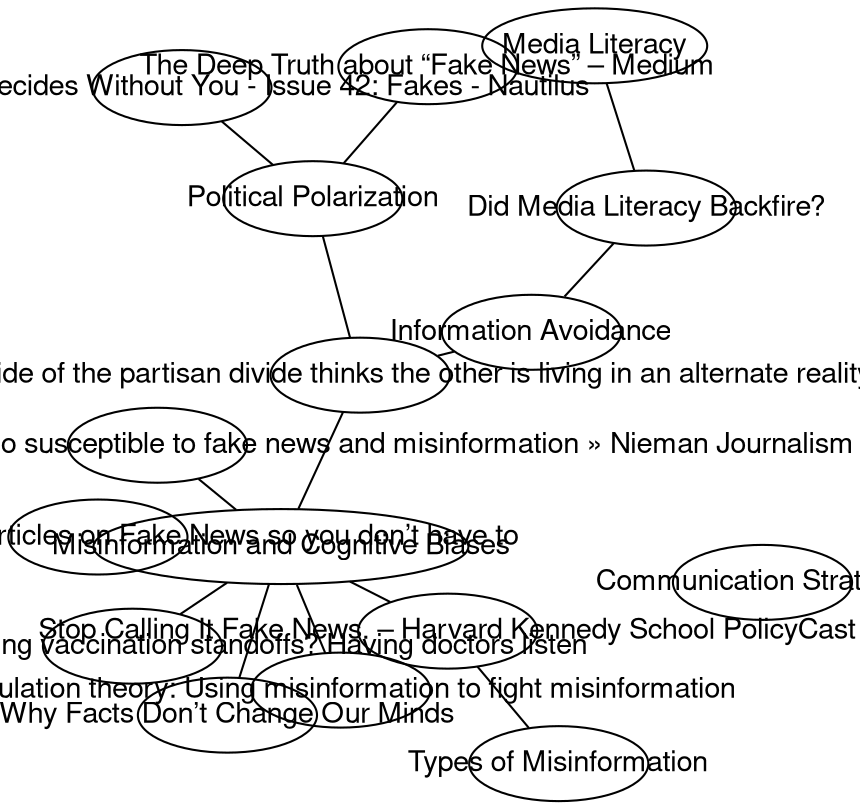
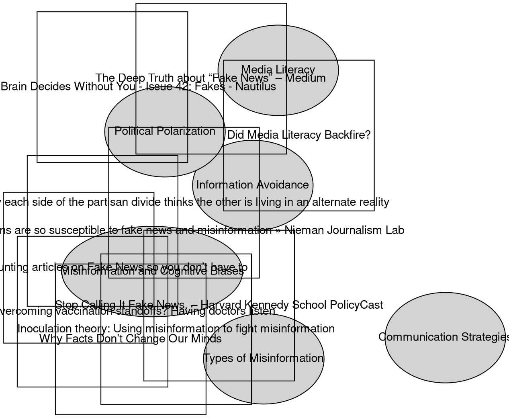

# Identifying Top Themes

#### You:
You are a superb organiser and classifier of ideas and content. First identify and briefly summarise the top themes running through some or all of the resources I'm providing you. The most important themes are relevant to the most resources, and should be listed first. Please ensure each theme's title is short, and only provide at most 7 themes to start with. Then ask me if I want you to remove some themes, or generate more, or rename some. Here are the resources:

 **A cognitive scientist explains why humans are so susceptible to fake news and misinformation » Nieman Journalism Lab**
   - URL: [Read More](https://www.niemanlab.org/2019/04/a-cognitive-scientist-explains-why-humans-are-so-susceptible-to-fake-news-and-misinformation/)
   - Main Content:
     How fake news gets into our minds, and what you can do to resist it... to understand why it gets into our mind... by examining how memory works and how memories become distorted.... Fake news often relies on misattribution ... we retrieve things from memory but can’t remember their source... one of the reasons advertising is so effective... Repeated exposure can increase the sense that misinformation is true... result in collective misremembering, a phenomenon called the Mandela Effect... We think of our memory as an archivist ... sometimes it’s a storyteller. Memories are shaped by our beliefs and can ... maintain a consistent narrative rather than an accurate record... our tendency to seek information that reinforces our pre-existing beliefs and to avoid information that brings those beliefs into question... television news audiences are disproportionately partisan and can exist in their own echo chambers. It was thought that online communities exhibit the same behavior... appears to be a myth

**I read 100-and-counting articles on Fake News so you don’t have to**
   - URL: [Read More](https://medium.com/@mathewlowry/i-read-100-and-counting-articles-on-fake-news-so-you-dont-have-to-31b8b1234a6d)
   - Main Content:
     A library, organised by topic

**Stop Calling It Fake News. – Harvard Kennedy School PolicyCast**
   - URL: [Read More](https://hkspolicycast.org/stop-calling-it-fake-news-6c86f9647e63)
   - Main Content:
     it just felt like the conversations that we were having subsequently were actually pretty shallow and actually pretty useless, because we were talking over each other because everybody meant different things... we can only really start talking about interventions if we understand what we’re talking about... I say, “Please don’t use the term.” “Yeah, but it’s going to help me get funding because it’s the sexy term right now\... as a shortcut, it’s lazy and it’s unhelpful and it’s being weaponized... you’ve proposed in your report, these three different types of information... Misinformation, disinformation, and mal-information... Misinformation is false information that’s not intended to cause harm... a mistake... That’s misleading...; Disinformation ... the person who is creating or sharing it knows that it’s false and is sharing it with the intent to cause harm....; mal-information... it’s genuine information... revealed to cause harm.... the people who are involved with this. It’s not just about one individual, one organization... four different types: financial, political, social and psychological... If we’re trying to stop those people who are motivated by financial motivations, there are a certain set of changes that we could do. Political disinformation is another set of motivations. If it’s social, it’s another set of motivations again... for each of these aspects, agents, messages and interpreters, we need to ask questions. For every particular piece of content, who is the agent, what do we know about them?... we’re seeing this as ... one big problem that we can solve with a tweak of an algorithm... we’re not going to ... if we don’t understand all the different types...

**The best shot at overcoming vaccination standoffs? Having doctors listen**
   - URL: [Read More](https://theconversation.com/the-best-shot-at-overcoming-vaccination-standoffs-having-doctors-listen-to-not-shun-reluctant-parents-81592)
   - Main Content:
     Clinicians should aim to understand parents’ values and engage in genuine, respectful conversations; these processes can help vaccine-hesitant parents feel heard and understood... Recognizing cognitive biases ... can also help ... omission bias may lead parents to blame themselves more if a child develops a vaccine-related side effect ... than ... if their child develops a vaccine-preventable disease...

**Inoculation theory: Using misinformation to fight misinformation**
   - URL: [Read More](https://theconversation.com/inoculation-theory-using-misinformation-to-fight-misinformation-77545)
   - Main Content:
     A little bit of something bad helps you resist a full-blown case... Inoculating text requires two elements. First, it includes an explicit warning about the danger of being misled by misinformation. Second, you need to provide counterarguments explaining the flaws in that misinformation...

**Why Facts Don’t Change Our Minds**
   - URL: [Read More](http://www.newyorker.com/magazine/2017/02/27/why-facts-dont-change-our-minds)
   - Main Content:
     If reason is designed to generate sound judgments, then it’s hard to conceive of a more serious design flaw than confirmation bias... We’re not driven only by emotions, of course—we also reason, deliberate. But reasoning comes later, works slower—and even then, it doesn’t take place in an emotional vacuum... Humans’ biggest advantage over other species is our ability to cooperate... “Reasoning was not designed to pursue the truth... and reasoning often works to generate post-hoc justifications for decisions we’ve already made... The “backfire effect” —when correcting misinformation hardens misperceptions... a way of reinforcing identity and our ties to others... it can become part of our identity and worldview\... for millennia, humans have relied on one another to find food, build shelter, and bear offspring. Given how much help we’ve needed to survive and reproduce, there’s good reason to want to get along with others... and reasoning evolved to help us do that... “Moral reasoning is often more about persuading others than it is about finding the truth... our reason is suffused with emotion... it doesn’t work through facts. It works through our sense of identity... We don’t need more studies on how to reduce belief in climate change... but rather on how to reduce political polarization...

**Title:** Why each side of the partisan divide thinks the other is living in an alternate reality
   **URL:** <https://theconversation.com/why-each-side-of-the-partisan-divide-thinks-the-other-is-living-in-an-alternate-reality-71458>
   To some liberals, Donald Trump’s inauguration portends doom... to many conservatives, it’s a crowning moment ... as if each side is living in ... a different reality.... information avoidance... all of us ... ward off any new information that makes us feel bad, obligates us to do something we don’t want to do or challenges our worldview\... we’re more likely to avoid threatening information when we feel like we don’t have the close relationships and support system in place to respond to new problems... retreat into our old, comforting worldviews... people don’t want to acknowledge a problem... because they don’t agree with the proposed solutions... Republicans were more likely to agree that climate change is happening when presented with the market-based solution... people are more willing to accept politically polarizing information if it’s discussed in a way that doesn’t challenge how they view the world or force them to do something they don’t want to do... ignoring the effects of information avoidance and discussing only ignorance and stubbornness does us all a disservice by framing the problem in partisan terms... Research suggests there are three ways to combat information avoidance...

**Title:** Did Media Literacy Backfire?
   **URL:** <https://points.datasociety.net/did-media-literacy-backfire-7418c084d88d>
   Anxious about... propaganda and fake news ... progressives are calling for an increased commitment to media literacy ... Others ... focus on expert fact-checking and labeling.  ... fail to take into consideration the cultural context ... Understanding what sources to trust is a basic tenet of media literacy education... underlying assumption ... New York Times, scientific journal publications, and experts with advanced degrees are all highly trustworthy. Think about how this might play out in communities where the “liberal media” is viewed with disdain as an untrustworthy source of information…or in those where science is seen as contradicting the knowledge of religious ... degrees are viewed as a weapon of the elite to justify oppression of working people... not everyone agrees on what makes a trusted source... We’ve been telling young people that they are the smartest snowflakes... and that they should trust their gut to make wise decisions... All they have to do is “do the research” for themselves.. If the media is reporting on something, and you don’t trust the media... If they expend tremendous effort bringing on “experts” to argue that something is false, there must be something there to investigate... with fake news, as experts blame “stupid” people for not understanding what is “real.” ... condescending at best. More experts are needed to label fake content. More media literacy is needed to teach people how not to be duped. And if we just push Facebook ... all will be solved.... if you present them with data that contradicts their beliefs, they will double down on their beliefs rather than integrate the new knowledge ... my assumptions and beliefs do not align with most Americans... as a scholar, I get to see how expert knowledge and information is produced and have a deep respect for the strengths and limitations of scientific inquiry...

**Title:** The Deep Truth about “Fake News” – Medium
   **URL:** <https://medium.com/@joe_brewer/the-deep-truth-about-fake-news-9634dc6f7c06>
   ... no one has direct access to reality. The real world is nearly impossible to see in this maelstrom ... because human minds need to “construct” their own version of reality — and each of us does this within a community of shared experiences and beliefs... there are many social worlds and each is built on its own version of what is real and true.... Our team took a unique dataset of 60 million tweets referencing the US election ... a global media conversation ... We used visualization software to create images of the relationships throughout this massive web of information... two very different conversations were taking place. The post-truthers were mostly elite media commentators ... “navel gazing” ... The media really likes to talk about the media! Contrast this with the fake news aficionados ... mostly grassroots groups and independent media outlets... Trump supporters, who actively criticized the “establishment” media as untrustworthy and unreliable... prone to trust information from authoritarian sources aligned with their worldview than the “authoritative” sources (like scientific expertise or official media outlets)... the very different conclusions people are drawing from failures in the media can be mapped to their modes of sharing and the networks they are embedded in... Both had important things to say, yet each was talking past the other... There has been propaganda for centuries. Misinformation campaigns are not new. What IS new is the decentralization of media creation that enables each community to remain isolated and separate. ... The media has cannibalized the minds of millions — drawing their mental attention toward the issues that are bounced around in these information echo chambers and syphoning it away from the deep, systemic threats humanity is now confronted with. Having a biased meshwork of corporate media outlets won’t be sufficient. Neither will the “democratized” independent people in the grassroots

**Title:** How Your Brain Decides Without You - Issue 42: Fakes - Nautilus
   **URL:** <http://nautil.us/issue/42/fakes/how-your-brain-decides-without-you-rp>
   The brain ... is an “inference generating organ.” ... predictive coding, according to which perceptions are driven by your own brain and corrected by input from the world... When “the sensory information ... does not match your prediction... you either change your prediction—or you change the sensory information that you receive.” We form our beliefs based on what comes to us from the world through the window of perception, but then those beliefs act like a lens, focusing on what they want to see. None of which bodes well for the idea that policy or other debates can be solved by simply giving people accurate information... polarization does not happen ... because one side is thinking more analytically, while the other wallows in unreasoned ignorance ... subjects who tested highest on measures like “cognitive reflection” and scientific literacy were also most likely to display ... “ideologically motivated cognition.” They were paying the most attention, seeing the duck they knew was there.

#### ChatGPT:
Based on the provided resources, here are the top themes that run through them:

1. **Misinformation and Fake News**: Several resources discuss the phenomenon of fake news, misinformation, and their impact on society. They explore how false information spreads and its consequences.

2. **Cognitive Biases**: The role of cognitive biases in shaping beliefs and behavior is a recurring theme. This includes confirmation bias, omission bias, and other biases that affect decision-making and information processing.

3. **Media Literacy**: The importance of media literacy in the digital age is highlighted, with discussions on how people can critically evaluate information sources and become more discerning consumers of news.

4. **Information Avoidance**: Resources address the tendency of individuals to avoid information that challenges their existing beliefs and how this can contribute to polarization and misinformation.

5. **Types of Misinformation**: Differentiating between types of misinformation, such as misinformation, disinformation, and mal-information, is discussed in some resources.

6. **Communication Strategies**: Strategies for combatting misinformation and promoting accurate information, including inoculation theory and effective communication techniques, are explored.

7. **Political Polarization**: The impact of political polarization on information consumption and belief systems is a recurring theme, emphasizing the division between different ideological groups.

Please let me know if you'd like to remove, generate more, or rename any of these themes, or if you have any other specific requests.

#### You:
Combine themes 1 and 5.

#### ChatGPT:
Certainly, here's the combined theme:

1. **Misinformation and Cognitive Biases**: Several resources discuss the phenomenon of fake news, misinformation, and their impact on society, examining how cognitive biases play a role in the spread of false information and its consequences. This theme encompasses both the nature of misinformation and the cognitive processes that influence its reception and propagation.

Please let me know if you'd like any further adjustments or have additional requests.

#### You:
Please now list the 6 themes

#### ChatGPT:
Certainly, here are the six themes based on your preferences:

1. **Misinformation and Cognitive Biases**: Several resources discuss the phenomenon of fake news, misinformation, and their impact on society, examining how cognitive biases play a role in the spread of false information and its consequences. This theme encompasses both the nature of misinformation and the cognitive processes that influence its reception and propagation.

2. **Media Literacy**: The importance of media literacy in the digital age is highlighted, with discussions on how people can critically evaluate information sources and become more discerning consumers of news.

3. **Information Avoidance**: Resources address the tendency of individuals to avoid information that challenges their existing beliefs and how this can contribute to polarization and misinformation.

4. **Communication Strategies**: Strategies for combatting misinformation and promoting accurate information, including inoculation theory and effective communication techniques, are explored.

5. **Political Polarization**: The impact of political polarization on information consumption and belief systems is a recurring theme, emphasizing the division between different ideological groups.

6. **Types of Misinformation**: Differentiating between types of misinformation, such as misinformation, disinformation, and mal-information, is discussed in some resources.

Please let me know if you'd like any further adjustments or have additional requests.

#### You:

Now you are going to generate the Graphviz code for a Entity-Relation Data Model concept map of these resources and themes, where each resources is connected to the relevant themes. The map's nodes representing the resources should all be squares and have the same size. The nodes representing the themes should be ellipses, and sized according to their importance: the most important theme should have the largest node. 

I will show you an example of some code for a concept map visualising 4 resources and three themes: 
graph ER {
	fontname="Helvetica,Arial,sans-serif"
	node [fontname="Helvetica,Arial,sans-serif"]
	edge [fontname="Helvetica,Arial,sans-serif"]
	layout=neato
	node [shape=box]; theme1; "theme 2"; theme3;
	node [shape=ellipse]; resource1; "resource 2"; "resource 3"; "resource 4"; 

	theme1 -- resource1;
	theme1 -- "resource 2";
    theme1 -- "resource 3";
	theme3 -- "resource 2";	
	"theme 2" -- "resource 2";
	theme3 -- resource1;
	theme3 -- "resource 4";	
	"theme 2" -- "resource 4";		
	label = "\n\A concept map\of your resources by theme";
	fontsize=20;
}

Now provide the same sort of code for the resources and themes, using the resource titles and the themes.

#### ChatGPT:
I've generated the Graphviz code for the Entity-Relation Data Model concept map based on your resources and themes. In this code, the nodes representing resources are squares, and the nodes representing themes are ellipses, sized according to their importance. The connections between resources and themes are also established. You can adjust the layout or style as needed.

You can use this code with Graphviz tools to generate a visual concept map of your resources and themes. Adjust the layout or styling as needed for your specific visualization preferences.

#### You:
All of the nodes in the code you provided are ellipses, and none of them are large enough to fit the titles inside it. Please rewrite the code so that the texts fit inside the nodes, the resources are represented by square nodes, and that only the nodes representing the themes are ellipses. Moreover, the themes should be drawn using lines with a thickness proportional to the theme's importance - the more important the theme, the thicker the line.

#### ChatGPT:
I apologize for the previous oversight. Here's the corrected Graphviz code with square nodes for resources, ellipses for themes, and line thickness proportional to theme importance:

This code should represent your concept map as you described, with square nodes for resources, ellipses for themes, and line thickness proportional to theme importance.
