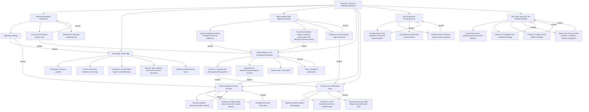
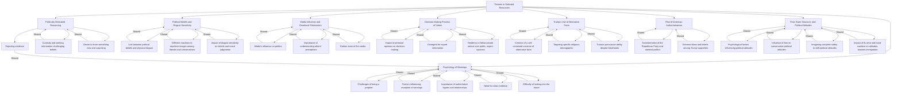

# ChatGPT integration test 3, created # 2023-07-25 10:53

## prompt 1
You are a superb organiser of ideas and content. Please identify the main themes running through the resources listed in the following collection: [prompt], which is named "Top resources tagged X & Y". Then identify the main subthemes within each theme, noting which subthemes appear in more than one theme. Finally, generate code in mermaid.js syntax for a mindmap of these themes and subthemes, giving the root of the mindmap the name of this collection. A shared subtheme should only appear once, linked to all relevant themes.

# answer 1
Main Themes:  
1. Backfire Effect  
2. Filter Bubbles and Echo Chambers  
3. Alternative Media and Conspiracy Theories  
4. Cognitive Biases and Resistance to Changing Beliefs  
5. Importance of Effective Communication and Persuasion  
  
Subthemes:  
  
Backfire Effect:  
- Resistance to changing beliefs  
- Strengthening of convictions  
- Difficulty of winning arguments online  
  
Filter Bubbles and Echo Chambers:  
- Local news and talk-radio influence  
- Impact of social media and journalist behavior  
- Priming alternative identities for better conversations  
  
Alternative Media and Conspiracy Theories:  
- Sustained participation by specific Twitter users  
- Political agenda of anti-globalism  
- Strategic disinformation and undermining trust in information  
  
Cognitive Biases and Resistance to Changing Beliefs:  
- Protection of beliefs from contradictory evidence  
- Biased assimilation and memory formation  
- Doubling down on beliefs despite knowing they are false  
  
Importance of Effective Communication and Persuasion:  
- Change My View subreddit as an experiment in changing minds  
- Writing out beliefs and presenting arguments effectively  
- AI-enhanced argument composition and pseudonymity for deeper connections  
  
Mindmap in mermaid.js syntax:  
  
graph LR  
A[Debunking in a world of tribes] --> B[Backfire Effect]  
A --> C[Filter Bubbles and Echo Chambers]  
A --> D[Alternative Media and Conspiracy Theories]  
A --> E[Cognitive Biases and Resistance to Changing Beliefs]  
A --> F[Importance of Effective Communication and Persuasion]  
D --> C  
D --> E  
B --> E  
C --> F  
E --> F

## prompt 2
You are a superb organiser of ideas and content. Please identify the main themes running through the resources listed in the following collection: [CONTEXT], which is named "Top resources tagged politics & psychology". Then identify the main subthemes within each theme, noting which subthemes appear in more than one theme. Finally, generate code in mermaid.js syntax for a mindmap of these themes and subthemes. Take care to include all the subthemes, but shared subthemes should only appear once, linked to all relevant themes. Give the root of the mindmap the name of this collection.

## answer 2
Main Themes:  
1. Politically Motivated Reasoning  
- Rejecting evidence that contradicts beliefs  
- Curiosity as an antidote  
- Science curiosity and reduced partisan bias  
- Motivation to learn something new and surprising over conformity  
  
2. Psychology of Warnings  
- Challenges of being a prophet  
- Myth of Cassandra as an example  
- Factors influencing the reception of warnings  
- Importance of authoritative figures and relationships  
- Clear evidence and avoiding excessive discomfort  
- Difficulty of looking far into the future  
- Delivering specific, actionable warnings  
  
3. Political Beliefs and Disgust Sensitivity  
- Link between political beliefs and physical disgust  
- Different reactions to repulsive images among liberals and conservatives  
- Impact of disgust sensitivity on beliefs and moral judgments  
- Connection between disgust sensitivity, conservatism, and behavioral immune system  
- Disgust as a tool to bypass logic and reason  
  
4. Media Influence and Emotional Polarization  
- Events vs. sociology and demography driving politics  
- Importance of understanding how others perceive you  
- Broken state of the media  
- Rise in emotional polarization  
  
5. Decision-Making Process of Voters  
- Personal opinions influencing decisions  
- Disregard for expert information  
- Tendency to follow private advice over public, expert opinions  
  
6. Trump's Use of "Alternative Facts"  
- Creation of a self-contained universe of misinformation  
- Targeting specific religious demographic  
- Digital campaign tactics and gamification  
- Trump's ability to convey conviction despite falsehoods  
  
7. Rise of American Authoritarianism  
- Transformation of the Republican Party and national politics  
- Extreme ideas and beliefs among Trump supporters  
- Matthew MacWilliams study on Trump as a symptom  
- Consequences beyond the current election  
  
8. Fear, Brain Structure, and Political Attitudes  
- Link between fear displayed in childhood and conservative attitudes  
- Influence of amygdala size on political ideology  
- Creating a sense of complete safety as a means to shift political attitudes  
- Impact of flu shot and hand sanitizer on attitudes towards immigration  
  
Main Subthemes:  
- Rejecting evidence  
- Curiosity and reduced partisan bias  
- Motivation for learning something new  
- Challenges of being a prophet  
- Factors influencing reception of warnings  
- Importance of authoritative figures and relationships  
- Need for clear evidence and avoid excessive discomfort  
- Difficulty of predicting the future  
- Impact of disgust sensitivity on beliefs and moral judgments  
- Connection between disgust sensitivity, conservatism, and behavioral immune system  
- Disgust as a tool to bypass logic and reason  
- Events vs. sociology and demography driving politics  
- Importance of understanding perceptions of others  
- Broken state of the media  
- Rise in emotional polarization  
- Personal opinions impacting decision-making  
- Disregard for expert information  
- Tendency to follow private advice over public, expert opinions  
- Creation of a self-contained universe of misinformation  
- Targeting specific religious demographic  
- Trump's persuasive ability despite using "alternative facts"  
- Transformation of the Republican Party and national politics  
- Extreme ideas and beliefs among Trump supporters  
- Consequences beyond the current election  
- Link between fear in childhood and conservative attitudes  
- Influence of amygdala size on political ideology  
- Creation of safety to shift political attitudes  
- Impact of flu shot and hand sanitizer on attitudes towards immigration  
  
Mindmap Code:  



## prompt 3
You are a superb organiser of ideas and content. Please identify the main themes running through the resources listed in the following collection: [CONTEXT], which is named "Top resources tagged politics & psychology". Then identify the main subthemes within each theme, noting which subthemes appear in more than one theme. Finally, generate code in mermaid.js syntax for a mindmap of these themes and subthemes. Take care to remove all quotation marks, and include all the subthemes, but shared subthemes should only appear once, linked to all relevant themes. Give the root of the mindmap the name of this collection.

## answer 3

Main Themes:  
1. Politically Motivated Reasoning  
2. Psychology of Warnings  
3. Political Beliefs and Disgust Sensitivity  
4. Media Influence and Emotional Polarization  
5. Decision-Making Process of Voters  
6. Trump's Use of Alternative Facts  
7. Rise of American Authoritarianism  
8. Fear, Brain Structure, and Political Attitudes  
  
Main Subthemes:  
1. Rejecting evidence [1]  
2. Curiosity and seeking information challenging beliefs [1]  
3. Desire to learn something new and surprising [1]  
4. Challenges of being a prophet [2]  
5. Factors influencing reception of warnings [2]  
6. Importance of authoritative figures and relationships [2]  
7. Need for clear evidence [2]  
8. Difficulty of looking into the future [2]  
9. Link between political beliefs and physical disgust [3]  
10. Different reactions to repulsive images among liberals and conservatives [3]  
11. Impact of disgust sensitivity on beliefs and moral judgments [3]  
12. Media's influence on politics [4]  
13. Importance of understanding others' perceptions [4]  
14. Broken state of the media [4]  
15. Impact of personal opinions on decision-making [5]  
16. Disregard for expert information [5]  
17. Tendency to follow private advice over public, expert opinions [5]  
18. Creation of a self-contained universe of "alternative facts" [6]  
19. Targeting specific religious demographic [6]  
20. Trump's persuasive ability despite falsehoods [6]  
21. Transformation of the Republican Party and national politics [7]  
22. Extreme ideas and beliefs among Trump supporters [7]  
23. Psychological factors influencing political attitudes [8]  
24. Influence of fear on conservative political attitudes [8]  
25. Imagining complete safety to shift political attitudes [8]  
26. Impact of flu shot and hand sanitizer on attitudes towards immigration [8]  
  
Mindmap Code:  


For this to work in mermaid.live, start with:
```
graph TB
A[Themes in Selected Resources]´´´ 

## Pilot integration
Firstly a quick note on the pilot integration. 

When I'm logged in I see the following form at https://myhub.ai/@mathewlowry/chat.
![[myhub-chatgpt-pilot-form.png]]

Using this form I can:
- paste into Context URLs the URL of a MyHub Collection - eg [All the Stuff I Like about Everything tagged #creativity & #innovation, Anytime](https://myhub.ai/@mathewlowry/?tags=creativity&types=like&timeframe=anytime&quality=all&tags=innovation). This defines the notes I want to chat with ChatGPT about
- optionally, include a search term in Search within context query to narrow down the content further
- Write a prompt to start the conversation with ChatGPT, including the content wherever I want to discuss by clicking the "insert content placeholder" button.

## Goal: MyHub Agents
The above form, however, is not what I intend releasing to the world: when my experiments are finished, logged-in Hub Editors will have dropdown access to a set of MyHub Agents, as well as a system for customising them, creating their own and sharing them as part of the MyHub user community.

Each of these Agents will be capable of taking any Collection of Hubbed items and carrying out a specific task - for example:

- summarise them for a newsletter,
- synthesise them for decisionmakers,
- mind-map their key concepts,
- serve as my inspirational muse, etc.

## Experimental programme variables
Each experiment involves a number of different variables:

- the **Agent Prompt**, corresponding to the task the Agent is designed to perform for the User
- the **Collection** of Hubbed items created by the User, to which the Agent Prompt is applied 
- the **Summariser** used (explained below)
- the **maximum length** applied using that Summariser (explained below).

![[experiment-method1.png]]
*This diagram is also explained left to right in [[chatgpt experiment - method]].*

My first experiment, for example, is called C-1-S-1-150-P-1: testing Prompt 1 on Collection 1 using Summariser 1 to a max length of 150 words. Let's take each in turn:

### The right Prompt for each Agent
**When I started investigating this I thought that designing each Agent would just be a question of finding the right Prompt.**

For example, **Prompt 1** is written to take a Collection of Hubbed notes and:

> "write a 500 word editorial summarising the main themes ... in particular highlighting themes common to several articles. Follow the editorial with the articles listed in the following format: 
> ## article title 
> An 80 word summary of the article. 
> 
> Provide all content in markdown format, with each article title linked to the URL provided with it." - [[Prompt 1 - newsletter A]]

But if it was that simple, I would have done many experiments by now.

### The right Summariser
**There's a complicating factor: the ChatGPT token limit.**

I'm using the ChatGPT3.5 API, which gives me a 16k context - ie, the content I throw at ChatGPT, and the content it throws back, should not be more than 16000 tokens, or ~12000 words. The moment I break that limit, ChatGPT will start "forgetting" earlier parts of the conversation.

After analysing the most active Hubs, I calculated that if MyHub Agents sent the full notes of each Hubbed item, it would break the token limit for any Collection over 15-20 items.

So we need a Summariser: once an Editor has Hubbed an item, MyHub checks its length. If it is over a certain length ("Summary Threshold"), MyHub will ask ChatGPT to create a Summary of the note, of length Summary Threshold.

Moreover, we also need Collection Composer: when an Editor activates an Agent, this algorithm checks the total length of all the notes in the Collection:

- if it's under (say) 8000 tokens, then ChatGPT is sent the full notes.
- on the other hand, if all the notes' Summaries total 8000 tokens, the Collection is rejected as too large from the outset
- something interesting happens in the middle ground: where the notes total over 8000 tokens, Collection Composer substitutes some notes with their Summaries, starting with notes which are not Highlighted and which are only slightly over the Summary Threshold.

In this way ChatGPT gets the Editor's notes of the Collection where possible, and their Summaries if the Collection's notes are either too numerous, too long, or both.

## Questions to answer
So we now have several questions requiring experiments to answer:

- What is the best Agent Prompt for each task?
- What is the best Summariser Prompt for capturing the essence of each note?
- How long should Summary Threshold be?

Moreover, is the best combination of Summariser Prompt, Summary Threshold and Agent Promot good for *all* Collections, or just the one I used in my first round of tests?

## Experimental nomenclature
Hence the name of my first experiment (C-1-S-1-150-P-1): testing Prompt 1 on Collection 1 using Summariser 1 to a max length of 150 words.

For the experiments to be meaningful, I need to compare several approaches in each experiment, which requires the creation of several files:

- Basic inputs
	- Collection 1: this is a URL, as set out above.
	- [[Prompt 1 - newsletter A]]
- **Summariser 0** is the original Summariser, written off the cuff for the ChatGPT pilot without much thought. It creates very short summaries and so serves as our "baseline Summariser" (see postscript).
	- [[C-1-S-0]] is the content ChatGPT received, created using Summariser 0 (ie short summaries of the Collection 1 notes)
	- hence [[C-1-S-0-response-P-1]]: what ChatGPT returns when sent C-1-S-0.md and asked Prompt 1
- **Summariser 1** (see [[Summarisers#^29496d]])
	- [[C-1-S-1-150]]: the content ChatGPT received, created using Summariser 1 set to 150 words
	- [[C-1-S-1-150-response-P-1]]: what ChatGPT returns when sent C-1-S-1-150 and asked Prompt 1
- **AllNotes**: to test if and how Summarisers affect the quality of ChatGPT's response, we need to apply the Prompt to the entirety of the notes, as well:
	- [[C-1-AllNotes]] contains the entirety of the notes in Collection 1, created by taking the [Collection's RSS feed](https://myhub.ai/rss/@mathewlowry/?tags=creativity&types=like&timeframe=anytime&quality=all&tags=innovation) and applying [[RSS AllNotes Prompt]]
	- [[C-1-AllNotes-response-P-1]]: what ChatGPT returns when sent C-1-AllNotes.md and asked Prompt 1
- finally, the analysis: [[Experiment 1 Analysis]], itself written with the help of ChatGPT ([[Experiment 1 Analysis chatgpt execsumm]]).